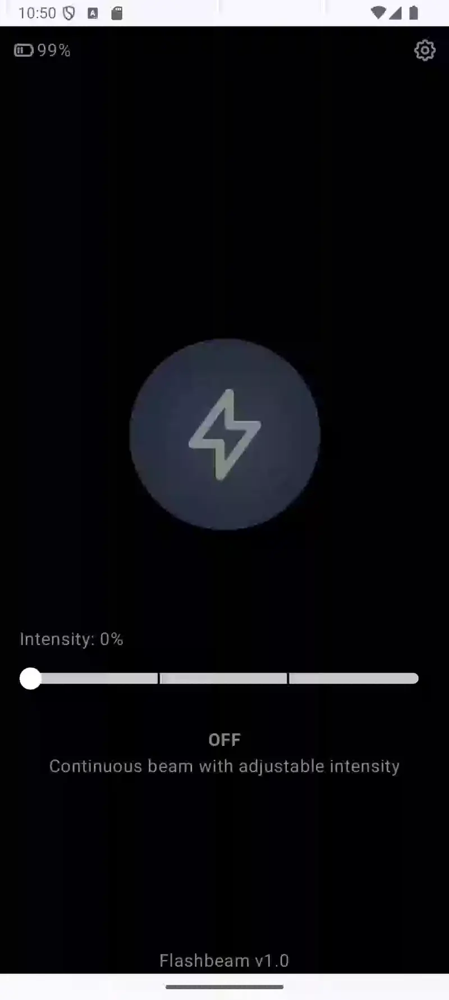

# Flashbeam v1.0

Flashbeam is an Android flashlight app that offers a customizable and efficient flashlight experience. With a bright mode and adjustable intensity, Flashbeam is designed to work seamlessly with your phone's camera flash and screen, providing a continuous beam to suit your needs.

## Features

- **Bright Mode:** Continuous beam with adjustable intensity, perfect for any environment.
- **Dark Mode:** A sleek dark theme for easy nighttime use.
- **Customizable Settings:**
  - Adjust the flashlight's brightness.
  - Enable or disable the screen flash.
  - Set an auto-off timer for convenience.
- **Notifications & Alerts:**
  - Battery alert to notify you when your battery is running low.
  - Vibration feedback for different actions in the app.

## Technologies Used

- **Jetpack Compose:** This app uses Jetpack Compose for building the UI with a modern, declarative approach to UI design in Android.
- **Android SDK:** Standard Android components and API to control the flashlight and the screen.
  
## Screenshots

Here are some screenshots of the app in action:

### Main Screen
The main screen features an easy-to-use interface with a brightness slider for adjusting the flashlight intensity.  

### Settings Screen
Here, you can customize the app's appearance, flashlight settings, and notifications.  

### Bright Mode
The Bright Mode section allows you to control the intensity and set the flashlight to your preferred level.  

## Installation

1. Clone this repository.
2. Open the project in Android Studio.
3. Build and run the app on an Android device.

## Contributing

Feel free to fork this repository and create a pull request with your improvements.

## License

This project is licensed under the MIT License - see the [LICENSE](LICENSE) file for details.
